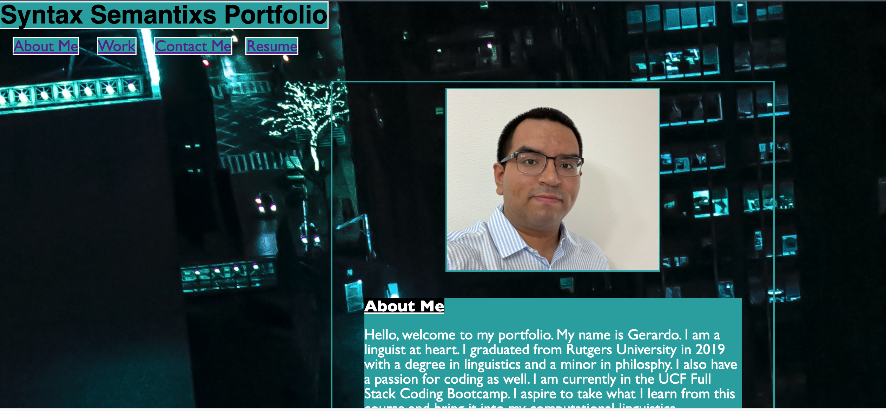
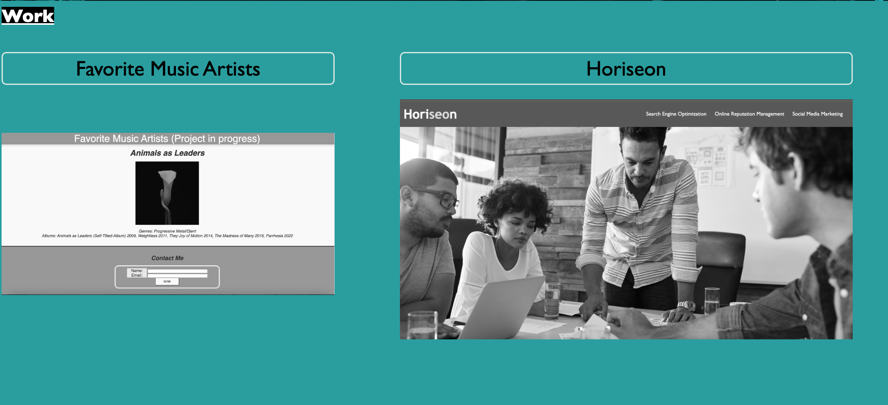

# syntax-semantixs-portfolio

## Description

#### Motivation for this project was to create a portfolio for myself. I built a webpage with an about me, work and contact info. I solved figuring out how to properly use CSS to bring my info to life. And learned a lot about parent and child elements within the page. I learned a lot of tricks to tell what I am specifically targeting within a container. I also learned how to change the properties of the page for both desktop and mobile use. Lastly I learned how to style the page with css and build this entire portfolio from scratch. (Note: For the best desktop view set to 75% zoom in chrome.)

## Usage

)

## MIT License

---

## Deployed Website

[Syntax Semantixs Portofolio](https://syntaxsemantixs.github.io/syntax-semantixs-portfolio/)
